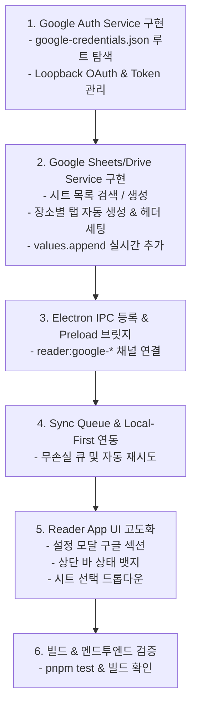

# 📋 Implementation Plan v1.2 — Google 스프레드시트 실시간 연동 (Serverless Client-to-Cloud)

**문서 버전**: v1.2  
**작성일**: 2026-08-20  
**상태**: 계획 수립 완료 (Plan Approved)  
**대상 모듈**: `reader` (QR 인식기), `shared`

---

## 1. 개요 및 목표

별도의 백엔드 웹 서버 없이 Electron 데스크톱 앱(`reader`)에서 직접 **Google Workspace(조직 계정)**으로 로그인하여,
1. 프로젝트 최상위 루트의 **`google-credentials.json`**을 기반으로 안전하게 OAuth 2.0 Loopback 인증을 수행합니다.
2. 사용자가 선택하거나 생성한 구글 스프레드시트에 **장소별 시트 탭(예: `입구`, `행복한나눔`)을 자동 생성**합니다.
3. QR 스캔 시 **실시간으로 구글 시트에 행을 추가(`values.append`)**하며, 네트워크 단절 시에도 데이터 유실이 없도록 **Local-First 무손실 큐(Zero-Loss Queue)**를 운영합니다.

---

## 2. 세부 설계 및 사양

### 2.1 인증 및 키 파일 관리 사양
- **Client Credentials 파일 경로 탐색 순서**:
  1. 프로젝트 최상위 루트: `./google-credentials.json` (기본 지정 위치)
  2. `reader` 하위 경로: `./reader/google-credentials.json`
  3. AppData 사용자 데이터 경로: `path.join(app.getPath('userData'), 'google-credentials.json')`
  4. UI 수동 파일 선택기: 설정 창에서 [📁 JSON 파일 선택]을 통해 임의 위치의 키 파일 불러오기 지원
- **인증 토큰 영속성 (Token Persistence)**:
  - 로그인 성공 후 발급된 `refresh_token`, `access_token`, `user_email`, `expires_at`을 `path.join(app.getPath('userData'), 'google-tokens.json')`에 안전하게 저장.
  - 앱 재시작 시 자동 로그인 및 만료 전 토큰 자동 갱신(Auto Refresh).
- **OAuth Loopback 인터페이스**:
  - 임시 로컬 루프백 서버(`http://127.0.0.1:0`)를 가동하여 시스템 기본 브라우저(`shell.openExternal`)로 구글 로그인 화면 호출.
  - 리다이렉트 수신 후 즉시 브라우저 완료 안내 화면 렌더링 및 로컬 서버 종료.

---

### 2.2 구글 드라이브 & 시트 서비스 사양 (`reader/src/main/services/googleSheetsService.ts`)

1. **스프레드시트 연동 방식 (3가지 지원 - 효율성 및 정확성 극대화)**:
   - **방식 1: 구글 시트 URL(링크) 직접 붙여넣기 (가장 확실 & 추천)**:
     - 사용자가 웹 브라우저에서 복사한 시트 주소(`https://docs.google.com/spreadsheets/d/시트ID/edit...`)를 입력창에 붙여넣기만 하면, 정규식으로 `spreadsheetId`를 자동 추출하여 즉시 연결 및 유효성 검증.
   - **방식 2: 최근 수정한 시트 상위 10개 빠른 드롭다운 (`pageSize: 10`, `orderBy: 'modifiedTime desc'`)**:
     - 조직 내 전체 시트를 무겁게 검색하지 않고, 최근 작업한 10개 시트만 가볍게 조회하여 드롭다운으로 제공.
   - **방식 3: [➕ 새 출입기록 시트 자동 생성]**:
     - 버튼 클릭 시 `기아대책_행사_출입기록_YYYYMMDD` 명칭으로 구글 드라이브에 신규 스프레드시트를 생성하고 즉시 연동.
2. **장소별 시트(탭) 자동 감지 및 생성 (`ensureLocationSheet`)**:
   - 현재 선택된 스프레드시트의 탭 목록 조회 (`spreadsheets.get`).
   - 현재 장소명(예: `입구`) 탭이 없으면 `spreadsheets.batchUpdate` (`AddSheetRequest`)로 탭 자동 생성.
   - 새 탭의 1행에 표준 7열 헤더 자동 삽입 및 서식 적용:
     ```
     [ 이사회명 | 직함 | 성명 | 티셔츠사이즈 | 방문장소 | 방문시각 | 중복방문여부 ]
     ```
3. **실시간 레코드 추가 (`appendRecords`)**:
   - `spreadsheets.values.append` (`valueInputOption=USER_ENTERED`)를 통해 해당 장소 탭에 1줄씩 또는 묶음으로 추가.
   - 기존 엑셀/CSV 규격과 100% 동일한 데이터 행 포맷:
     `[affiliation, title, name, tshirtSize, location, scannedAt, isDuplicate ? '중복' : '정상']`

---

### 2.3 무손실 동기화 큐 (Sync Queue & Offline Fallback)

1. **Local-First 원칙**:
   - QR 스캔 시 1순위로 로컬 스토리지(`localStorage` / `scanHistory`)에 즉시 저장 및 UI 성공 팝업 표출 (스캔 지연 0ms).
2. **백그라운드 동기화 큐**:
   - 구글 시트 연동 활성화 상태인 경우 큐에 레코드 Push ➡️ 비동기 전송.
   - 네트워크 오류 또는 API 일시 실패 시: 큐에 보관 후 5초 간격으로 자동 재시도.
   - 온라인 복구 시: 누적된 대기 레코드를 묶음(`Batch Append`)으로 일괄 전송.

---

### 2.4 UI / UX 디자인 및 화면 흐름 (`reader/src/renderer/App.tsx`)

1. **상단 Header Bar 상태 인디케이터**:
   - 🟢 `구글 시트: [시트명] - [장소명] 탭 (실시간 연동 중)`
   - 🟡 `구글 시트: 동기화 대기 N건 (네트워크 확인 중)`
   - ⚪ `구글 시트: 로컬 단독 모드`
2. **[⚙️ 설정] 모달 내 '📊 구글 스프레드시트 실시간 연동' 섹션**:
   - **인증 상태**:
     - 미인증 시: `google-credentials.json` 감지 상태 표시 + [🔑 구글 계정 로그인] 버튼 + [📁 키 파일 직접 선택]
     - 인증 완료 시: 로그인된 구글 계정(`user@kfhi.or.kr`) + [로그아웃] 버튼
   - **연동 시트 설정 (3가지 편리한 방법 제공)**:
     - 🔗 **구글 시트 링크(URL) 입력**: 브라우저에서 복사한 주소를 붙여넣고 [연동] 클릭
     - 📋 **최근 시트(10개) 선택 드롭다운**: 최근 수정한 10개 목록에서 원클릭 선택
     - ➕ **[새 출입기록 시트 생성] 버튼**: 구글 드라이브에 신규 파일 즉시 자동 생성
     - 🌐 **[선택한 시트 웹에서 열기] 바로가기 버튼**
   - **실시간 동기화 스위치**: On/Off 토글 지원

---

## 3. 단계별 구현 절차



### [Step 1] Google Auth Service 모듈 구현
- `reader/src/main/services/googleAuth.ts`
  - 프로젝트 최상위 루트의 `google-credentials.json` 로드 및 파싱 (installed/web/flat 형식 모두 지원).
  - Loopback HTTP 서버 구동 및 Auth Code 수신.
  - Token 발급/저장/자동 갱신 로직.

### [Step 2] Google Sheets & Drive API 클라이언트 구현
- `reader/src/main/services/googleSheets.ts`
  - Node.js 내장 `fetch` / `https` 기반의 경량 REST 클라이언트 (추가 대용량 의존성 없이 초경량 번들 유지).
  - 드라이브 시트 목록 조회 (`GET /drive/v3/files`)
  - 스프레드시트 생성 (`POST /sheets/v4/spreadsheets`)
  - 장소 탭 존재 확인 및 자동 생성 (`batchUpdate` `AddSheet`)
  - 행 데이터 추가 (`values/{tabName}!A:G:append`)

### [Step 3] Electron Main IPC 및 Preload 브릿지 연동
- `reader/src/main/index.ts`:
  - `reader:google-get-status`: 키 파일 존재 여부 및 로그인 계정 정보
  - `reader:google-load-credentials`: 수동 파일 선택
  - `reader:google-login`: OAuth 로그인 시작
  - `reader:google-logout`: 로그아웃 및 토큰 삭제
  - `reader:google-list-sheets`: 스프레드시트 목록 반환
  - `reader:google-create-sheet`: 새 시트 생성
  - `reader:google-sync-record`: 레코드 추가
  - `reader:google-open-sheet-url`: 기본 브라우저로 시트 열기
- `reader/src/main/preload.ts`: `window.electronAPI.google` 브릿지 노출.

### [Step 4] Renderer UI 및 Sync Queue 연동
- `reader/src/renderer/App.tsx`:
  - 설정 모달 내 구글 스프레드시트 연동 UI 통합.
  - 상단 Header Bar 연동 상태 표시 배지.
  - Local-First 오프라인 무손실 큐 및 상태 관리.

### [Step 5] 유닛 테스트 및 빌드 검증
- `pnpm test` 유닛 테스트 실행.
- `pnpm --filter reader build` 번들링 검증.

---

## 4. 추가 개선 및 방어 아키텍처 (v1.2.1)

### 4.1 버그 수정 및 UX 개선
1. **구글 로그아웃 시 UI 즉시 갱신**:
   - `handleGoogleLogout` 실행 시 `googleAuth` 상태 및 `googleSyncConfig`를 즉시 초기화하여 미인증 상태 UI로 깨끗하게 전환.
2. **장소 변경 및 설정 복귀 시 인풋 포커싱 복구**:
   - 장소 등록 폼으로 복귀 시 `useEffect` 및 `useRef`를 통해 `inputLocation` 요소에 `.focus()`를 자동 강제하여 Alt+Tab 없이 즉시 타이핑 가능하도록 개선.

### 4.2 보안 편의성 개선: 비밀번호(`2026-NDS`) 모달 완전 제거
- 현장 운영의 신속성을 위해 CSV 내보내기 및 QR 기록 초기화 시 불필요한 비밀번호 입력 절차를 제거하고 직관적인 `confirm` 대화상자로 간소화.

### 4.3 다중 기기(Multi-Client) 동시 접속 시 Google API Quota (분당 300회) 방어 아키텍처

여러 대의 노트북에서 동시에 QR 스캔 시 분당 300회 한도(또는 사용자당 60회) 초과를 원천 방지하기 위한 **4중 방어 시스템**:

1. **방어 1: 시트 탭 메타데이터 인메모리 캐싱 (API 호출 50% 절감)**
   - 기존에는 매 스캔마다 `getSpreadsheetDetails`(메타데이터 조회) + `values.append`(행 추가)로 2회 호출되던 것을, 한 번 확인된 탭(`입구`, `행복한나눔` 등)은 인메모리 `Set`에 캐싱하여 **1스캔당 1호출**로 절감.
2. **방어 2: 스마트 마이크로 디바운스 배치 전송 (Adaptive Dynamic Batching)**
   - 스캔이 연속으로 발생할 때 800ms~1000ms 동안 유입된 스캔 레코드를 묶음(`Batch`)으로 1회 `values.append`에 전송.
   - 피크 시간대(입장 몰림)에 기기당 호출 횟수를 **분당 15~20회 수준으로 70% 이상 억제**.
3. **방어 3: HTTP 429(할당량 초과) 지수 백오프 + 무작위 지터(Exponential Backoff with Jitter)**
   - 구글에서 429 또는 503 응답 수신 시, 즉시 재시도하지 않고 지수 함수(`base * 2^retry + jitter`)로 기기별 재시도 타이밍을 분산.
   - Local-First 큐에 안전하게 보관되므로 현장 스캔은 끊김 없이 계속 진행되며, 한도가 풀리면 누적된 N건을 **단 1회의 묶음 요청으로 즉시 일괄 적재**.
4. **방어 4: UI 실시간 한도 조절 상태 표시**
   - 상단 바에 `🟡 동기화 대기 N건 (호출 한도 조절 중 - N초 후 재시도)`로 현장 운영자에게 명확한 상태 피드백 제공.
