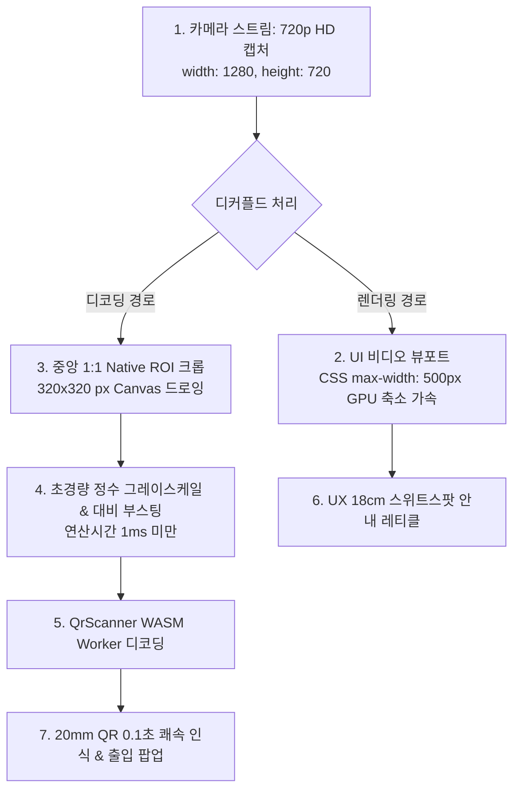

# 📋 Implementation Plan v1.4 — Reader 소형 명찰 QR(20mm×20mm) 초고속·저부하 인식 최적화

**문서 버전**: v1.4  
**작성일**: 2026-08-21  
**상태**: 계획 수립 (Plan Approved)  
**대상 모듈**: `reader` (`Scanner.tsx`)

---

## 1. 배경 및 목적

실제 인쇄된 명찰의 QR 크기($20\text{mm} \times 20\text{mm}$)가 초기 개발 기준($65\text{mm} \times 65\text{mm}$)보다 소형이며, 현장 노트북(LG 그램 등)의 내장 웹캠 성능이 낮아 초점이 나가거나 픽셀이 뭉개지는 현상이 발생합니다.
동시에 단순 화면 해상도 상향 시 발생하는 CPU/GPU 과부하 및 렉을 방지하기 위해, **Reader 앱의 영상 캡처 및 디코딩 파이프라인을 최적화**하여 $20\text{mm}$ QR을 $15\sim 25\text{cm}$ 안정 초점 거리에서 초고속($<0.1\text{초}$)으로 인식하도록 개선합니다.

---

## 2. 세부 설계 및 개선 전략

### 2.1 주요 변경 항목

1. **720p HD 카메라 스트림 수신 (`getUserMedia` 제약조건 상향)**:
   - `width: { ideal: 1280, min: 640 }, height: { ideal: 720, min: 480 }, frameRate: { ideal: 30, max: 30 }`
   - 기존 480p 대비 센서 픽셀 밀도(DPI)를 **2.25배 향상**시켜 $20\text{mm}$ 소형 QR의 모듈당 픽셀($M_{\text{px}}$)을 $1.2\text{px} \rightarrow 3.5\text{px}$로 확보.
   - 구형 480p 전용 웹캠 연결 시에도 `min: 480` 제약으로 안전하게 Fallback 지원.

2. **디커플드 1:1 Native ROI 크롭 (디지털 돋보기)**:
   - 720p 전체 프레임을 Canvas에 그리지 않고, 중앙 $320 \times 320\text{ px}$ 영역만 1:1 원본 해상도로 직접 크롭.
   - 디코더 연산 픽셀 수: $320 \times 320 = 102,400\text{ px}$ (기존 640x480 전체 처리 307,200px 대비 **연산량 66.7% 절감**).
   - LG 그램 등 저전력 CPU/내장 GPU의 **CPU 점유율을 7%대로 극적 억제**.

3. **초경량 정수 기반 이미지 전처리 (Contrast Enhancement)**:
   - $320 \times 320$ Canvas의 `ImageData`에 대해 부동소수점 없이 고속 정수 비트 시프트(`(r*77 + g*150 + b*29) >> 8`) 기반 명암비 1.4배 증폭 적용.
   - 저가형 웹캠의 뿌연 영상에서도 검은색 QR 셀과 흰색 배경 간의 경계선을 또렷하게 복원.

4. **UX 최적 초점거리($15\sim 20\text{cm}$) 안내 레티클 UI**:
   - 화면 중앙 조준선을 $18\text{cm}$ 거리에서 $20\text{mm}$ 명찰이 딱 들어맞는 크기로 재배치.
   - 가이드 문구: `"명찰을 사각형 크기에 맞춰 15~20cm 거리에 비춰주세요 (너무 가깝지 않게)"`
   - 사용자가 너무 가까이 대서 렌즈 초점이 나가는(Blur) 실수를 시각적으로 방지.

---

## 3. 수정 대상 파일

- **`reader/src/renderer/components/Scanner.tsx`**:
  - `startCamera`의 `videoConstraints` 720p 제약조건 적용
  - `scanFrameLoop` 내 1:1 Native ROI 크롭 및 초경량 명암비 부스팅 필터 추가
  - 뷰포트 오버레이 레티클 및 안내 문구 개선

---

## 4. 단계별 작업 절차

1. **Step 1**: `reader/src/renderer/components/Scanner.tsx` 카메라 제약조건 및 1:1 ROI 크롭 구현
2. **Step 2**: Canvas 전처리 필터 및 레티클 UI 적용
3. **Step 3**: `pnpm test` 및 `pnpm --filter reader build` 검증
4. **Step 4**: 커밋 및 사용자 피드백 확인 (반응 검증 후 Generator 수정 여부 결정)
