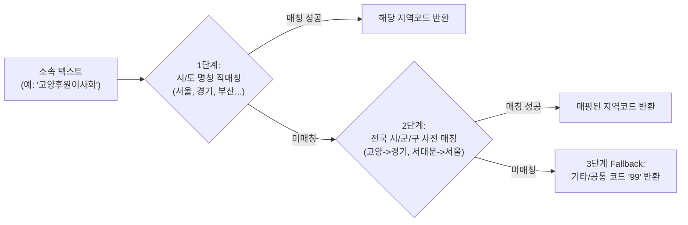
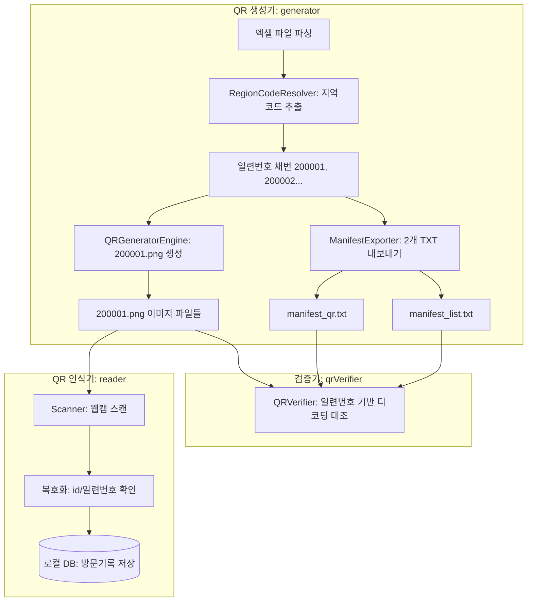

# 🔬 Research Report v1.4 — 지역번호 기반 일련번호 자동 채번 및 InDesign 이원화 매니페스트(Dual Manifest) 아키텍처 연구

**문서 버전**: v1.4  
**작성일**: 2026-08-24  
**상태**: 연구 완료 (Research Complete)  
**대상 모듈**: `generator` (QR 생성기), `shared` (공통 타입/유틸), `reader` (QR 인식기)

---

## 1. 개요 및 요구사항 정의

### 1.1 배경 및 목적
기존 QR 생성기는 참석자 명단(Excel)을 바탕으로 `{이사회명}_{직책}_{성명}.png` 형태의 한글 파일명을 생성하고, 단일 매니페스트(`manifest.txt`)에 인적 정보와 QR 파일명을 함께 기록하였습니다.
그러나 실제 **Adobe InDesign Data Merge**를 통한 대량 명찰 인쇄 및 현장 관리 과정에서 다음과 같은 실무적 요구사항이 발생하였습니다:

1. **인쇄 데이터 머지 최적화**: 텍스트 데이터(성명, 직함, 소속)와 이미지 데이터(QR코드)의 분리 관리가 필요함.
2. **파일명 표준화 및 오류 방지**: 긴 한글 파일명 대신 고유 일련번호(Serial Number) 기반의 영숫자 파일명(`200001.png`)을 적용하여 파일 시스템 호환성 및 InDesign 링크 안정성 확보.
3. **지역별 권역 체계 관리**: 엑셀에 관리번호가 없더라도, 소속 이사회명을 기반으로 **한국 국내 전화번호 지역번호(끝 2자리) + 4자리 순번(0001~9999)**으로 구성된 고유 일련번호를 자동 채번.

---

### 1.2 핵심 요구사항 5대 항목 요약

| 번호 | 요구사항 | 상세 설명 |
| :---: | :--- | :--- |
| **REQ-1** | **일련번호 자동 채번 & 매니페스트 기록** | QR 생성 시점에 참석자별 고유 일련번호를 부여하고, 매니페스트 파일에 일련번호를 기록 |
| **REQ-2** | **매니페스트 2종 분리 생성 (Dual Manifest)** | ① **명단 정보 매니페스트**: QR 컬럼 제외, 일련번호 + 인적 정보만 포함<br>② **QR 매핑 매니페스트**: 일련번호 + `#QR코드` 파일 경로만 포함 |
| **REQ-3** | **QR 이미지 파일명 규칙 변경** | 기존 `{이사회명}_{직책}_{성명}.png` $\rightarrow$ **`{일련번호}.png`** (예: `200001.png`) |
| **REQ-4** | **지역번호 기반 6자리 일련번호 규칙** | **지역번호 끝 2자리 + 4자리 순번(0001~9999)**<br>• 서울(`02`)은 특수 규칙 **`20`** 부여<br>• 동일 지역 권역 내 이사회들은 순번을 연속 누적 (최대 10,000명 대응) |
| **REQ-5** | **엑셀 원본 비침투적 설계** | 엑셀 원본에는 일련번호 컬럼이 존재하지 않으며, QR 생성기가 관리용으로 동적 발급 |

---

## 2. 일련번호(Serial Number) 체계 및 채번 알고리즘

### 2.1 일련번호 구조 (총 6자리 숫자)

$$\mathbf{Serial\ Number} = \underbrace{RR}_{\text{지역코드 (2자리)}} + \underbrace{NNNN}_{\text{권역 순번 (4자리, 0001}\sim\text{9999)}}$$

```
  ┌─── Region Code (2자리) ───┐   ┌── Sequence Number (4자리) ──┐
  │  서울: 20                  │   │  0001 ~ 9999                │
  │  경기: 31, 인천: 32 ...   │   │  (동일 권역 내 누적 순번)     │
  └───────────────────────────┘   └─────────────────────────────┘
  예: 서울 동대문 1번 => "200001", 서울 서대문 1번 => "200002"
```

* **자릿수 검증**: 2자리 지역코드 + 4자리 순번 = **총 6자리 문자열(숫자형)** 포맷.
* **수용 용량**: 권역당 최대 **10,000명** ($0001 \sim 9999$ 및 $0000$)까지 고유번호 부여 가능.

---

### 2.2 대한민국 전화 지역번호(Area Code) 매핑 테이블

한국 국내 유선전화 지역번호 체계를 기반으로 끝 2자리를 추출하며, 2자리인 서울(`02`)은 규정에 따라 `20`으로 매핑합니다.

| 시/도 구분 | 유선전화 지역번호 | 지역코드 Prefix (2자리) | 채번 예시 (첫 번째 참석자) |
| :--- | :---: | :---: | :---: |
| **서울특별시** | `02` | **`20`** (특수 규칙) | `200001` |
| **경기도** | `031` | **`31`** | `310001` |
| **인천광역시** | `032` | **`32`** | `320001` |
| **강원특별자치도** | `033` | **`33`** | `330001` |
| **충청남도** | `041` | **`41`** | `410001` |
| **대전광역시** | `042` | **`42`** | `420001` |
| **충청북도** | `043` | **`43`** | `430001` |
| **세종특별자치시** | `044` | **`44`** | `440001` |
| **부산광역시** | `051` | **`51`** | `510001` |
| **울산광역시** | `052` | **`52`** | `520001` |
| **대구광역시** | `053` | **`53`** | `530001` |
| **경상북도** | `054` | **`54`** | `540001` |
| **경상남도** | `055` | **`55`** | `550001` |
| **전라남도** | `061` | **`61`** | `610001` |
| **광주광역시** | `062` | **`62`** | `620001` |
| **전북특별자치도** | `063` | **`63`** | `630001` |
| **제주특별자치도** | `064` | **`64`** | `640001` |
| **기타 / 미분류 / 해외** | - | **`99`** (기본 Fallback) | `990001` |

---

### 2.3 이사회명(소속) 기반 지역코드 자동 분석 엔진 (Region Code Resolver)

사용자가 입력한 엑셀의 소속명(예: `서울동대문후원이사회`, `고양후원이사회`, `광주북부후원이사회`, `서대문이사회`)에서 지역 키워드를 안전하게 추출하기 위한 3단계 분석 파이프라인:



#### 전국 주요 시·군·구 키워드 사전 매핑 룰 (예시)
- **서울 (`20`)**: `서울`, `강남`, `강동`, `강북`, `강서`, `관악`, `광진`, `구로`, `금천`, `노원`, `도봉`, `동대문`, `동작`, `마포`, `서대문`, `서초`, `성동`, `성북`, `송파`, `양천`, `영등포`, `용산`, `은평`, `종로`, `중구`, `중랑`
- **경기 (`31`)**: `경기`, `고양`, `과천`, `광명`, `광주(경기)`, `구리`, `군포`, `김포`, `남양주`, `동두천`, `부천`, `성남`, `수원`, `시흥`, `안산`, `안성`, `안양`, `양주`, `양평`, `여주`, `연천`, `오산`, `용인`, `의왕`, `의정부`, `이천`, `파주`, `평택`, `포천`, `하남`, `화성`
- **인천 (`32`)**: `인천`, `강화`, `계양`, `남동`, `미추홀`, `부평`, `연수`, `옹진`
- **강원 (`33`)**: `강원`, `춘천`, `원주`, `강릉`, `동해`, `태백`, `속초`, `삼척`, `홍천`, `횡성`, `영월`, `평창`, `정선`, `철원`, `화천`, `양구`, `인제`, `고성(강원)`, `양양`
- **충남 (`41`)**: `충남`, `충청남`, `천안`, `공주`, `보령`, `아산`, `서산`, `논산`, `계룡`, `당진`, `금산`, `부여`, `서천`, `청양`, `홍성`, `예산`, `태안`
- **대전 (`42`)**: `대전`, `유성`, `대덕`
- **충북 (`43`)**: `충북`, `충청북`, `청주`, `충주`, `제천`, `보은`, `옥천`, `영동`, `증평`, `진천`, `괴산`, `음성`, `단양`
- **세종 (`44`)**: `세종`
- **부산 (`51`)**: `부산`, `해운대`, `사하`, `금정`, `연제`, `수영`, `사상`, `기장`, `부산진`, `동래`, `영도`
- **울산 (`52`)**: `울산`, `울주`
- **대구 (`53`)**: `대구`, `수성`, `달서`, `달성`
- **경북 (`54`)**: `경북`, `경상북`, `포항`, `경주`, `김천`, `안동`, `구미`, `영주`, `영천`, `상주`, `문경`, `경산`, `군위`, `의성`, `청송`, `영양`, `영덕`, `청도`, `고령`, `성주`, `칠곡`, `예천`, `봉화`, `울진`, `울릉`
- **경남 (`55`)**: `경남`, `경상남`, `창원`, `진주`, `통영`, `사천`, `김해`, `밀양`, `거제`, `양산`, `의령`, `함안`, `창녕`, `고성(경남)`, `남해`, `하동`, `산청`, `함양`, `거창`, `합천`
- **전남 (`61`)**: `전남`, `전라남`, `목포`, `여수`, `순천`, `나주`, `광양`, `담양`, `곡성`, `구례`, `고흥`, `보성`, `화순`, `장흥`, `강진`, `해남`, `영암`, `무안`, `함평`, `영광`, `장성`, `완도`, `진도`, `신안`
- **광주 (`62`)**: `광주`, `광산` (단, '경기 광주'는 31로 우선 처리)
- **전북 (`63`)**: `전북`, `전라북`, `전주`, `군산`, `익산`, `정읍`, `남원`, `김제`, `완주`, `진안`, `무주`, `장수`, `임실`, `순창`, `고창`, `부안`
- **제주 (`64`)**: `제주`, `서귀포`

---

### 2.4 권역별 순번 누적 (Global Sequential Counter per Region)

동일한 권역 코드(`RR`)에 속하는 모든 참석자는 이사회명이 달라도 하나의 카운터를 공유하여 순차 채번됩니다.

#### 채번 시뮬레이션
```typescript
const regionCounters = new Map<string, number>();

// 1. 서울동대문이사회 홍길동 -> Region '20' -> 순번 1 -> "200001"
// 2. 서울서대문이사회 김철수 -> Region '20' -> 순번 2 -> "200002"
// 3. 고양후원이사회 이순신   -> Region '31' -> 순번 1 -> "310001"
// 4. 파주후원이사회 강감찬   -> Region '31' -> 순번 2 -> "310002"
// 5. 서울강남이사회 유관순   -> Region '20' -> 순번 3 -> "200003"
```

---

## 3. 이원화 매니페스트(Dual Manifest) 구조 설계

Adobe InDesign의 **데이터 병합(Data Merge)** 기능은 탭 구분 텍스트(`\t`, UTF-16 LE with BOM)를 표준으로 사용합니다.  
텍스트 레이아웃과 QR 이미지 링크를 완벽히 분리하고, 상호 간 `일련번호`를 기본 키(Primary Key)로 조인할 수 있도록 2개의 TXT 파일을 생성합니다.

```
📁 출력 디렉터리 (Output Directory)
├── 📄 manifest_list.txt        <-- [파일 1] 인적 정보 매니페스트 (QR 컬럼 없음)
├── 📄 manifest_qr.txt          <-- [파일 2] QR 파일 매핑 매니페스트 (일련번호 + QR경로)
├── 🖼️ 200001.png               <-- QR 이미지 1
├── 🖼️ 200002.png               <-- QR 이미지 2
└── 🖼️ 310001.png               <-- QR 이미지 3
```

---

### 3.1 [파일 1] 참석자 명단 정보 매니페스트 (`manifest_list.txt`)

* **목적**: 명찰의 텍스트 필드(이사회명, 직함, 성명) 병합 및 관리자 명단 확인
* **인코딩**: `UTF-16 LE` (BOM `\uFEFF` 포함, InDesign 100% 호환)
* **구분자**: 탭(`\t`), 줄바꿈(`\r\n`)
* **헤더 구조**: `이사회명\t직함\t성명`

#### 파일 내용 예시
```text
이사회명	직함	성명
서울동대문후원이사회	회장	홍길동
서울서대문후원이사회	총무	김영희
서울서대문후원이사회	사모	박순자
고양후원이사회	이사	이순신
파주후원이사회	회장	강감찬
```

---

### 3.2 [파일 2] QR 매핑 매니페스트 (`manifest_qr.txt`)

* **목적**: InDesign Data Merge의 이미지 전용 필드(`#QR코드`) 매핑
* **인코딩**: `UTF-16 LE` (BOM `\uFEFF` 포함)
* **구분자**: 탭(`\t`), 줄바꿈(`\r\n`)
* **헤더 구조**: `일련번호\t#QR코드`

#### 파일 내용 예시
```text
일련번호	#QR코드
200001	200001.png
200002	200002.png
200003	200003.png
310001	310001.png
310002	310002.png
```

> **InDesign Data Merge 참고사항**:  
> InDesign에서 컬럼명이 `#`으로 시작하는 열(예: `#QR코드`)은 이미지 배치(Image Placement) 필드로 자동 인식됩니다. 상대 경로(`200001.png`)로 작성하면 TXT 파일과 동일한 폴더에 있는 이미지를 InDesign이 자동으로 찾아 프레임에 배치합니다.

---

## 4. 시스템 영향도 및 변경점 분석 (Impact Analysis)



### 4.1 모듈별 상세 변경 계획

| 컴포넌트 | 파일 경로 | 주요 수정 내용 |
| :--- | :--- | :--- |
| **Shared Types** | [`shared/src/types/index.ts`](file:///C:/Users/20260602/Documents/github/kfhi-seminar-checker/shared/src/types/index.ts) | `ManifestRecord`에 `managementNumber`(일련번호) 필드 필수화, `QRPayload` 및 `DualManifestResult` 타입 정의 |
| **Region Resolver** | `generator/src/utils/regionResolver.ts` | (신규) 소속명 분석 $\rightarrow$ 전화 지역번호 끝 2자리 반환 엔진 |
| **QR Generator Engine** | [`generator/src/services/qrGenerator.ts`](file:///C:/Users/20260602/Documents/github/kfhi-seminar-checker/generator/src/services/qrGenerator.ts) | • `regionCounters` 맵을 통한 6자리 일련번호 채번<br>• 파일명 생성: `${managementNumber}.png`<br>• QR 페이로드 내 일련번호(`id`) 포함 |
| **Manifest Exporter** | [`generator/src/services/manifestExporter.ts`](file:///C:/Users/20260602/Documents/github/kfhi-seminar-checker/generator/src/services/manifestExporter.ts) | • `exportDualTxt()` 메서드 구현<br>• `manifest_list.txt` (정보용) & `manifest_qr.txt` (QR용) 분리 출력 |
| **QR Verifier** | [`generator/src/services/qrVerifier.ts`](file:///C:/Users/20260602/Documents/github/kfhi-seminar-checker/generator/src/services/qrVerifier.ts) | 일련번호 기반 파일명(`200001.png`) 및 듀얼 매니페스트 대조 검증 지원 |
| **Generator UI** | [`generator/src/renderer/App.tsx`](file:///C:/Users/20260602/Documents/github/kfhi-seminar-checker/generator/src/renderer/App.tsx) | • 미리보기 화면에 '일련번호' 및 '파일명'(`200001.png`) 반영<br>• 완료 화면에 2개 매니페스트 파일 안내 표시 |

---

## 5. 결론 및 구현 준비 상태

1. **요구사항의 기술적 타당성**:
   - 엑셀 수정 없이 생성기 내부에서 소속 기반으로 지역코드를 판별하고, 6자리 일련번호를 부여하는 방식은 엑셀 데이터 작업자의 부담을 완전히 없애는 최적의 UX입니다.
2. **InDesign 호환성 극대화**:
   - 탭 구분 UTF-16 LE 포맷의 듀얼 매니페스트(`manifest_list.txt`, `manifest_qr.txt`)와 일련번호 영숫자 파일명(`200001.png`)은 대량 인쇄 편집 환경에서 한글 깨짐 및 파일 링크 단절을 100% 방지합니다.
3. **다음 단계**:
   - 본 Research 결과를 바탕으로 상세 구현 계획(Plan v1.5) 수립 및 코드 적용을 진행합니다.
